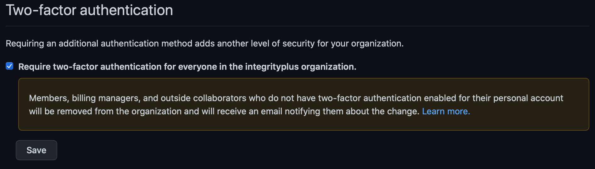

# How I approached the solution
I have given the customer an imaginary name.

**Company Name:** Integrity Plus Inc.
**Department:** Security and Compliance

The solution was prepared by _Ayodeji Ayodele_ , no external resources were used.

## Problem Statement
- Ensure proper code reviews for all code being added to our repositories.
- Looking for the best way to do it at scale.
- Using OOTB settings is most preferable.

## Solution Approach
In addition to GitHub which serves as the primary service for storing and managing code, two main platforms were used in the solution.

|  Platform       | Purpose |
| --------------- | ------- |
| Azure Logic App | Web API for receiving webhook deliveries from the GitHub organization. Visit the [src](src/readme.md) directory for documentation on architecture and how to deploy. |
| Azure Boards    | Project tracking and management  |

### Setup a GitHub organization

  - **Create a new organization**: This is the first natural step to take, as this customer is a business and not an individual. organizations are shared accounts where businesses can collaborate across many projects. 
    - Organisation name - [integrityplus](https://github.com/integrityplus)
  - **Invite people, create teams and apply relevant roles**: 
    - Invite people: I registered one additional github user _@ayooutlook_ and invited it into the new organization. At least two users is needed in order to simulate different roles and code review approvals.
    - Create teams: I created a team _@integrityplus/security-and-compliance_ and granted it the **security manager** role. Members of a team with the security manager role have only the permissions required to effectively manager the security for the organization. [Read more](https://docs.github.com/en/organizations/managing-peoples-access-to-your-organization-with-roles/managing-security-managers-in-your-organization)
  
### Secure the organization
It is important to configure security features in the organization to complement the specific security requirements in the customer's brief. The following features were enabled in the organization:

- Two-factor authentication: Zero-trust security is essential to ensure only the right people have access to the customer's code.

_Two-factor authentication is enabled._

- Code security and analysis
  - Enable dependency graph
  - Enable dependabot alerts
  - Enable dependabot security updates  
  
### Create a .github repository
The .github directory is used to store community health files as well as the organization profile. The following were added:
- `SECURITY.md` to serve as the default security policy for every new repository created in the organization.
- `ISSUE_TEMPLATE/branch-protection-issue-template.md` to serve as the content template for the issue that would be automatically created in the repository once the branch protection has been applied on the default branch.
- `profile/README.md` to give a profile description of the organization.

### Implement default branch protection
This was achieved with two components, a webhook to listen to [organization events](https://docs.github.com/en/developers/webhooks-and-events/webhooks/webhook-events-and-payloads), and a [custom web API](src/readme.md) to receive the delivery of the webhook's payload and orchestrate the application of the branch protection as well as create the issue in the repository.

**Webhook**

> Before creating the webhook, the URL of the API needs to be ready. Therefore, you should already deploy/host the web API before carrying out this step.

The webhook was created with the following properties:
| Property | Value |
| --- | --- |
| Payload URL | [Web API endpoint URL](https://prod-25.australiasoutheast.logic.azure.com:443/workflows/91ac34239e004414aaa5d6e0165ff4b2/triggers/manual/paths/invoke?api-version=2016-10-01&sp=%2Ftriggers%2Fmanual%2Frun&sv=1.0&sig=VKMrn4L8wdN3C4mvi1WreDRm2O7R19MAH6wrmzpEOUk) |
| Content type | application/json |
| SSL verification | Enable |
| Events to trigger | Branch or tag creation _(only 1 event)_ |

**Web API**
A separate [documentation](src/readme.md) is dedicated to the Web API. Please visit the src directory.

