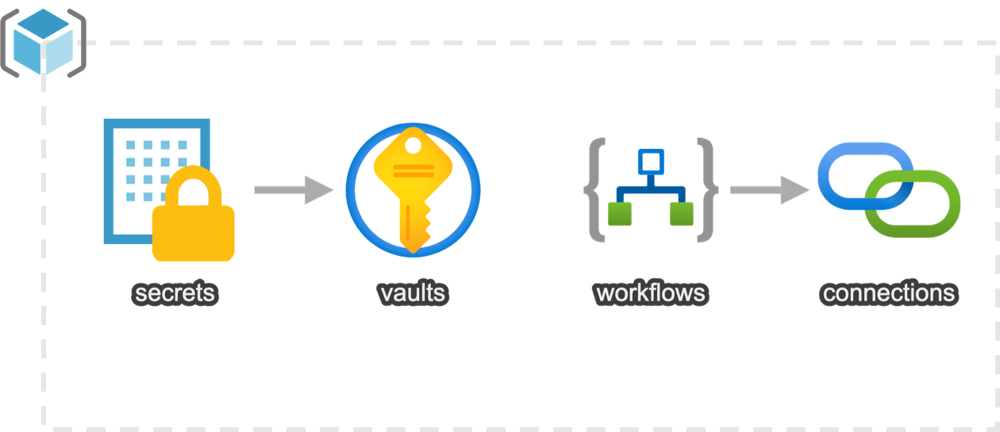
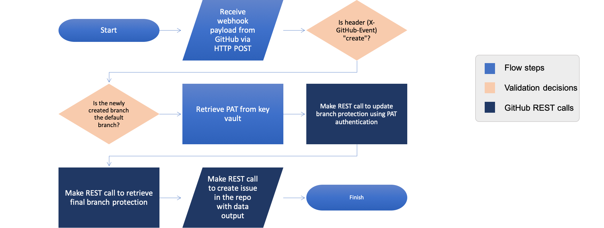
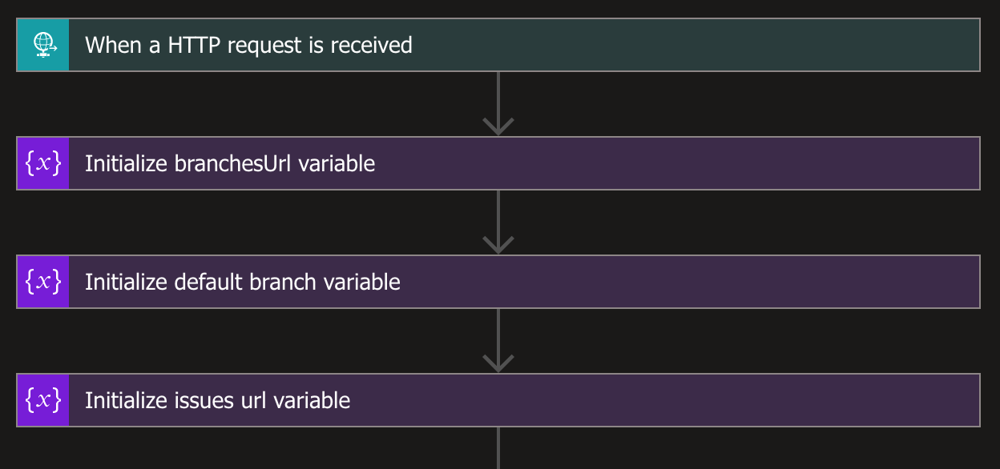
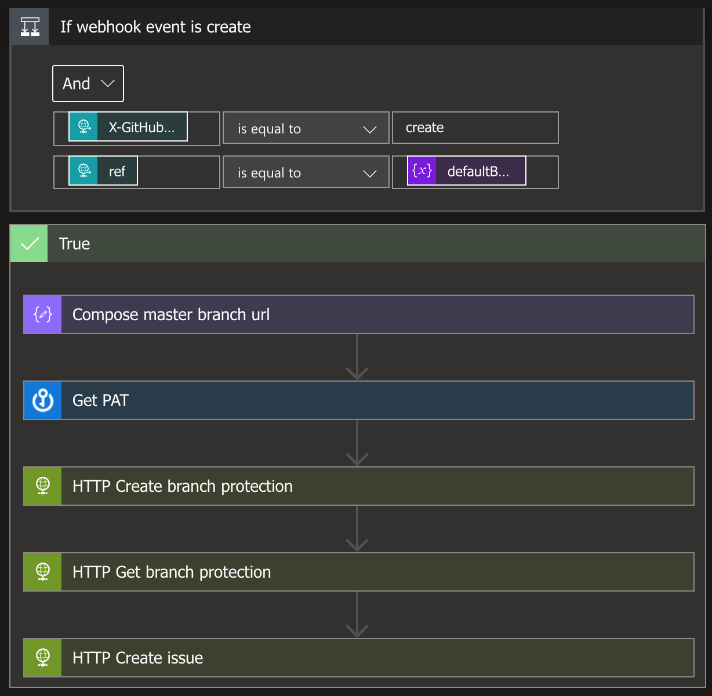

# API Documentation

Please keep your source files here, and remember to add some good documentation 😉

[](https://dev.azure.com/ayotoday/90fb8fe1-1601-4c43-ac1b-11de1158286a/_boards/board/t/d2da950a-6a9d-41f4-aecc-3647caa4b755/Microsoft.RequirementCategory/)

[](https://portal.azure.com/#create/Microsoft.Template/uri/https%3A%2F%2Fraw.githubusercontent.com%2Fintegrityplus%2Fsolution-presentation%2Fmain%2Fsrc%2Ftemplate.json)

# Architecture
## General overview of solution architecture
Two Azure service components were used in setting up the API
| Component       | Description |
| --------------- | ----------- |
| Azure Logic App | Primary API PaaS using containerised runtime |
| Azure Key Vault | Vault for storing secrets and personal access token to connect to the GitHub organization |

</img>

## API Logic Flow
The web API depends on the GitHub [REST API](https://docs.github.com/en/rest) (branches and issues) for retrieving and sending data to/from the GitHub organization. This makes use of [Basic Authentication](https://docs.github.com/en/rest/overview/other-authentication-methods#via-oauth-and-personal-access-tokens) using OAuth tokens. The authentication token is stored as a secret in the key vault during infrastructure-as-code [deployment](#how-to-deploy).


> To successfully make REST API calls to GitHub, you need to [generate a Personal Access Token (PAT)](https://docs.github.com/en/authentication/keeping-your-account-and-data-secure/creating-a-personal-access-token#creating-a-token) for the user who is an owner of the organization.
> GitHub has discontinued password authentication to the API starting on November 13, 2020 for all GitHub.com accounts, including those on a GitHub Free, GitHub Pro, GitHub Team, or GitHub Enterprise Cloud plan. You must now authenticate to the GitHub API with an API token, such as an OAuth access token, GitHub App installation access token, or personal access token.

The diagram below shows the logic flow of the web API.

</img>

### Trigger event
The webhook, as mentioned in the [solution approach](/README.md#webhook), generates a payload whenever a branch or tag is created on any repository in the organization. The API App is configured with a manual trigger, listening to a POST call, and the JSON schema is matched with what is expected to be received.

The API then stores three important properties from the request body in variables.
| Property                     | Description |
| ---------------------------- | ----------- |
| `body.repository.branches_url` | The API URL to manage branches of the repo. Removed the trailing `{/branch}` |
| `body.master_branch`           | The default branch name of the repo. Appended this to the branches URL later in the code |
| `body.repository.issues_url`   | The API URL to manage issues of the repo. Removed the trailing `{/number}` |

</img>


### Validation
The request header in the payload comes with a header property `X-GitHub-Event` that indicates which organization event fired the webhook. In the case of branch creation, the value of this header is expected to be `create`. Below is a sample request header.

```json
  "headers": {
    "Connection": "close",
    "Accept": "*/*",
    "Host": "prod-25.australiasoutheast.logic.azure.com:443",
    "User-Agent": "GitHub-Hookshot/d51dd3b",
    "X-GitHub-Delivery": "934d6c40-a908-11ec-87c3-c76e6c2397e3",
    "X-GitHub-Event": "create",
    "X-GitHub-Hook-ID": "348815410",
    "X-GitHub-Hook-Installation-Target-ID": "101906266",
    "X-GitHub-Hook-Installation-Target-Type": "organization",
    "Content-Length": "7439",
    "Content-Type": "application/json"
  }
```

In addition to validating the event, the API also verifies if the branch created matches the default branch name for the repository i.e. `body.ref` should be the same as `body.master_branch`. 

The following is an example payload showing the branch that was newly created in the repository is `main` and  the default branch name for the repository is also `main`. Note that the majority of the JSON content has been removed from this example for brevity.

```json
  "body": {
    "ref": "main",
    "ref_type": "branch",
    "master_branch": "main",
    "description": "Repo for storing solution and documentation",
    "pusher_type": "user",
    "repository": {
      "id": 471815219,
      "node_id": "R_kgDOHB9UMw",
      "name": "solution-presentation",
      "full_name": "integrityplus/solution-presentation",
      ...
      "site_admin": false
     },
     "html_url": "https://github.com/integrityplus/solution-presentation",
     "description": "Repo for storing solution and documentation",
     ...
     "branches_url": "https://api.github.com/repos/integrityplus/solution-presentation/branches{/branch}",
     ...
     "issues_url": "https://api.github.com/repos/integrityplus/solution-presentation/issues{/number}",
     ...
   }
  }
```

### Processing
Once validated to be true for both conditions, the API retrieves the personal access token from the key vault and passes this along with the username as Basic Authentication in subsequent API calls.

**API Calls**
1. [Update branch protection](https://docs.github.com/en/rest/reference/branches#update-branch-protection) :: `HTTP PUT`
2. [Get branch protection](https://docs.github.com/en/rest/reference/branches#get-branch-protection) :: `HTTP GET`
3. [Create an issue](https://docs.github.com/en/rest/reference/issues#create-an-issue) :: `HTTP POST`




## How to Deploy
This makes use of Azure ARM template deployment, using a [template file](template.json). For other deployment methods please visit [deployment operations on Azure](https://docs.microsoft.com/en-us/azure/azure-resource-manager/templates/deploy-portal).

### Manual Deployment

[](https://portal.azure.com/#create/Microsoft.Template/uri/https%3A%2F%2Fraw.githubusercontent.com%2Fintegrityplus%2Fsolution-presentation%2Fmain%2Fsrc%2Ftemplate.json)

#### Pre-requisites for deployment
 - [x] An Azure subscription with at least `Contributor` role on the existing resource group or permissions to create a new one.
 - [x] A GitHub personal access token, copy temporarily to a text file. People with `admin` permissions to a repository can manage branch protection rules.
 
 #### Parameters required
 | Parameter Name        | Type         | Description |
 | --------------------- | ------------ | --- |
 | Key Vault Name        | string       | Name of the key vault resource. |
 | Logic App Name        | string       | Name of the logic app resource. |
 | Connection Name       | string       | Name of the connection resource connecting the logic app to the key vault. |
 | Personal Access Token | secureString | Personal access token copied earlier. |

 #### Post-deployment steps
 Once the logic app is ready, open the logic app resource and click on Logic App designer. Then, click on the _When HTTP request is received_ trigger to expand it. Then copy the `HTTP POST URL` text into a temporary text file. Then create a webhook with the properties specified in the [solution approach](/README.md/#Implement-default-branch-protection).

</img>

### Continuous Deployment
A [GitHub Action workflow](https://github.com/integrityplus/solution-presentation/actions/workflows/cicd-logic-app.yml) has been configured to aid continuous delivery and continuous deployment purposes. This is powered by a [YAML workflow](/.github/workflows/cicd-logic-app.yml).

| Workflow Triggers                    |
| ------------------------------------ |
| On push to the `main` branch.        |
| On pull request to the `main` branch |
| On workflow dispatch                 |

#### Variables & Secrets
The following secrets were used as variables in the workflow and are required for a successful deployment:

| Repository Secrets                  | Description           |
| ----------------------------------- | --------------------- |
| AZ_RG_DV_SUBSCRIPTION               | Azure Subscription Id |
| AZ_RG_DV_TENANT_ID                  | Azure Tenant Id       |

| Environment Secrets (Staging) | Description                |
| --------------------------- | ---------------------------- | 
| AZ_RG_DV_CONNECTION_NAME | Name of the connection resource |
| AZ_RG_DV_KEYVAULT_NAME   | Name of the key vault           |
| AZ_RG_DV_LOCATION        | Name of the Azure region        |
| AZ_RG_DV_LOGICAPP_NAME   | Name of the logic app           |
| AZ_RG_DV_RESOURCE_GROUP  | Name of the resource group      |
| INTPLUS_GITHUB_APP_SECRET| PAT token for GitHub            |

